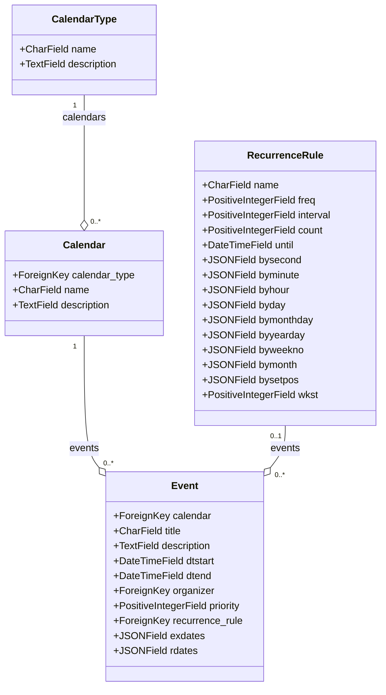

# Data models

## Class diagram

```mermaid
classDiagram
    class CalendarType {
        +CharField name
        +TextField description
    }

    class Calendar {
        +ForeignKey calendar_type
        +CharField name
        +TextField description
    }

    class RecurrenceRule {
        +CharField name
        +PositiveIntegerField freq
        +PositiveIntegerField interval
        +PositiveIntegerField count
        +DateTimeField until
        +JSONField bysecond
        +JSONField byminute
        +JSONField byhour
        +JSONField byday
        +JSONField bymonthday
        +JSONField byyearday
        +JSONField byweekno
        +JSONField bymonth
        +JSONField bysetpos
        +PositiveIntegerField wkst
    }

    class Event {
        +ForeignKey calendar
        +CharField title
        +TextField description
        +DateTimeField dtstart
        +DateTimeField dtend
        +ForeignKey organizer
        +PositiveIntegerField priority
        +ForeignKey recurrence_rule
        +JSONField exdates
        +JSONField rdates
    }

    CalendarType "1" --o "0..*" Calendar : calendars
    Calendar "1" --o "0..*" Event : events
    RecurrenceRule "0..1" --o "0..*" Event : events
```
